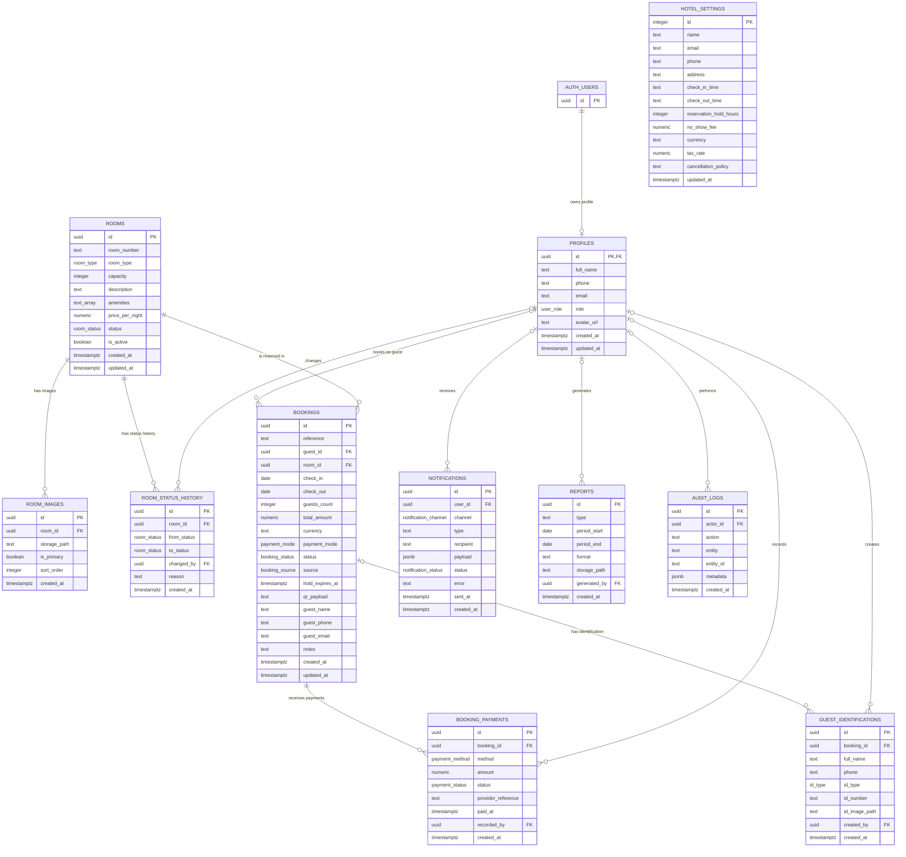

# Mount Patrick Hotel — Entity Relationship Diagram

Generated from the live Supabase database schema on 18 August 2026. The diagram includes the
application tables in the `public` schema and the external relationship to Supabase Auth's
`auth.users` table. Supabase internal schemas and Storage system tables are intentionally omitted.

## Relationship summary

- A Supabase Auth user may have one application profile.
- A profile may make many bookings; walk-in bookings may have no linked profile.
- A room may have many bookings, images, and status-history entries.
- A booking may have many payments and guest-identification records.
- Staff profiles may record payments, create identification records, change room statuses,
  generate reports, receive notifications, and appear in audit logs.
- `hotel_settings` is a standalone singleton-style configuration table.

Nullable foreign keys are shown as optional relationships. Primary and foreign key labels reflect
the constraints found in the live database at generation time.
